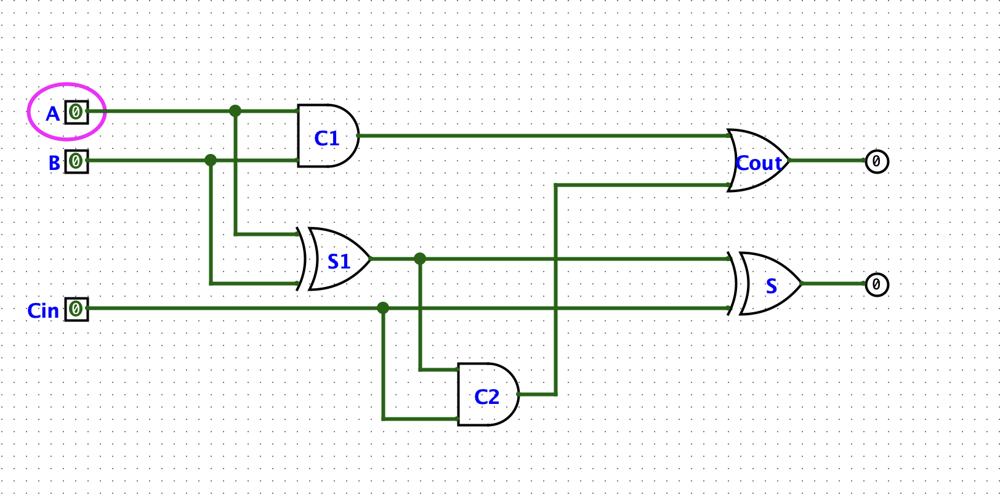

# 📚 L1.2 全加器(Full Adder) 学习笔记

> 日期:2026-07-01
> 目标:理解"半加器为啥不够 → 怎么用 2 个半加器 + 1 个 OR 拼出全加器"

---

## 一、为什么需要"全加器"?—— 半加器的死穴

L1.1 我们搭了半加器,能算 `A + B`,产出 S 和 C。

但**多位加法**(比如 `5 + 3 = 8`,二进制 `101 + 011`)里,**每一位都可能"收到右边送来的进位"**。

举例:算 `5 + 3` 的中位那一列:

```
  真实情况:0 + 1 + 1(右边低位算完送来了进位 1)
  ────
        ↑
       这是 3 个东西要加,不是 2 个
```

**问题:** 半加器只有 2 个输入口(A、B),**接不住第三个"Cin"**。

→ 需要一个**多一个输入口**的电路:全加器(Full Adder)。

---

## 二、全加器的接口

| 输入 | 含义 |
|------|------|
| `A` | 当前位的第 1 个数(1 bit) |
| `B` | 当前位的第 2 个数(1 bit) |
| `Cin` | **右边那位算完送过来的进位**(1 bit) |

| 输出 | 含义 |
|------|------|
| `S` | 本位的"和"(1 bit) |
| `Cout` | **往更高位送的进位**(1 bit) |

> **重要:Cin 不是"第三个要加的数",而是"上一步的副产品"。**

---

## 三、真值表(8 行,3 输入)

| Cin | A | B | S | Cout |
|:---:|:-:|:-:|:-:|:----:|
|  0  | 0 | 0 | 0 |  0   |
|  0  | 0 | 1 | 1 |  0   |
|  0  | 1 | 0 | 1 |  0   |
|  0  | 1 | 1 | 0 |  1   |
|  1  | 0 | 0 | 1 |  0   |
|  1  | 0 | 1 | 0 |  1   |
|  1  | 1 | 0 | 0 |  1   |
|  1  | 1 | 1 | 1 |  1   |

**关键:** 上面 4 行(Cin=0)半加器能算,**下面 4 行(Cin=1)半加器算不了** —— 这就是为啥要升级到全加器。

---

## 四、推导表达式

### S 列(`0, 1, 1, 0, 1, 0, 0, 1`)

| Cin | A | B | S |
|:---:|:-:|:-:|:-:|
|  0  | 0 | 0 | 0 |
|  0  | 0 | 1 | 1 |
|  0  | 1 | 0 | 1 |
|  0  | 1 | 1 | 0 |
|  1  | 0 | 0 | 1 |
|  1  | 0 | 1 | 0 |
|  1  | 1 | 0 | 0 |
|  1  | 1 | 1 | 1 |

**规律:** S=1 的行是 (Cin, A, B) 中**有奇数个 1** 的行 → **3 个输入的 XOR**

```
S = A ⊕ B ⊕ Cin
```

### Cout 列(`0, 0, 0, 1, 0, 1, 1, 1`)

**规律:** Cout=1 的条件 —— **A=B=1**(2 个 1)或 **Cin=1 且 A⊕B=1**(2 个 1):

```
Cout = A·B + Cin·(A⊕B)
```

---

## 五、怎么拼?—— 套路:**先加前 2 个,再加第 3 个**

**核心思路(就像小学算 `2+3+4` —— 先算 `2+3=5` 再算 `5+4=9`):**

> **半加器只能加 2 个数。3 个数怎么加?—— 拆成 2 次"两个数相加"。**

### 5.1 设计步骤

**步骤 1:半加器 1 算 `A + B`**
```
→ 输出 S1(中间和)、C1(进位)
→ S1 = A ⊕ B,C1 = A · B
```

**步骤 2:半加器 2 算 `S1 + Cin`**
```
→ 输出 S(最终本位)、C2(进位)
→ S = S1 ⊕ Cin,C2 = S1 · Cin
```

**步骤 3:OR 门合并 `C1 + C2`**
```
→ 输出 Cout
→ Cout = C1 + C2
```

### 5.2 为什么 OR 门"刚好"等价于加法?

**关键观察:C1 和 C2 永远不会同时为 1(互斥)。**

证明:
- C1=1 → A=B=1 → S1=A⊕B=0 → C2=S1·Cin=0(不管 Cin 啥)
- 反过来:C2=1 → S1=1 且 Cin=1 → A⊕B=1 → A 和 B 不全 1 → C1=A·B=0

| C1 | C2 | OR 输出 | C1+C2 |
|:--:|:--:|:-------:|:-----:|
|  0 |  0 |    0    |   0   |
|  1 |  0 |    1    |   1   |
|  0 |  1 |    1    |   1   |
|  1 |  1 | 不会发生 |   -   |

**第 4 行永远不会触发,所以 OR 和加法在这个位置完全等价。**

---

## 六、Logisim 实现

### 6.1 元件清单

| 类型 | 数量 | 用途 |
|------|------|------|
| Input Pin | 3 | A、B、Cin(facing=East) |
| Output Pin | 2 | S、Cout(facing=West) |
| XOR 门 | 2 | 半加器 1 + 半加器 2 各 1 |
| AND 门 | 2 | 半加器 1 + 半加器 2 各 1 |
| OR 门 |  1 | 合并 C1、C2 |

**总计:5 个逻辑门 + 3 输入 + 2 输出。**

### 6.2 12 根线连接表

| # | 起点 | 终点 |
|---|------|------|
| 1 | A 输入 | XOR1 上 |
| 2 | A 输入 | AND1 上 |
| 3 | B 输入 | XOR1 下 |
| 4 | B 输入 | AND1 下 |
| 5 | XOR1 输出 | XOR2 上 |
| 6 | XOR1 输出 | AND2 上 |
| 7 | Cin 输入 | XOR2 下 |
| 8 | Cin 输入 | AND2 下 |
| 9 | XOR2 输出 | S 输出 |
| 10 | AND1 输出 | OR 上 |
| 11 | AND2 输出 | OR 下 |
| 12 | OR 输出 | Cout 输出 |

### 6.3 实际电路图



*图:A、B、Cin 在左侧,S、Cout 在右侧;中间两个半加器(XOR+AND 各一对)串起来,下方 OR 门合并两个进位。*

---

## 七、验证 checklist

拨 8 种组合,核对真值表(**特别留意 Cin=1 那 4 行**):

- [ ] Cin=0, A=0, B=0 → S=0, Cout=0 ✓
- [ ] Cin=0, A=0, B=1 → S=1, Cout=0 ✓
- [ ] Cin=0, A=1, B=0 → S=1, Cout=0 ✓
- [ ] Cin=0, A=1, B=1 → S=0, Cout=1 ✓
- [ ] Cin=1, A=0, B=0 → S=1, Cout=0 ✓
- [ ] Cin=1, A=0, B=1 → S=0, Cout=1 ✓
- [ ] Cin=1, A=1, B=0 → S=0, Cout=1 ✓
- [ ] Cin=1, A=1, B=1 → S=1, Cout=1 ✓

8 个全对,全加器就算通了 ✅

---

## 八、踩坑记录(给自己提个醒)

### 8.1 ASCII 电路图不可靠

我之前用 ASCII 字符画电路图,画错了几次(线条交叉处表示不清,容易把"分叉"画成"汇合")。

**教训:** 电路图要看就去看标准图,不要试图用 ASCII 重新表达。维基百科、circuitdigest 都有标准画法。

### 8.2 "XOR 算和"是结果,不是因果

我之前说过一句烂话:"算'和',用 XOR 因为 1+1=0 这种进位情况要用 XOR 区分" —— 这表述是错的。

**正确的理解:**

```
XOR 的真值表  →  跟"加法本位的值"刚好一致
                 →  所以用 XOR 实现"本位的值"
```

是"对应关系",不是"因果关系"。XOR 不是因为"能区分"才被选用,而是因为"它的真值表恰好就是本位和的定义"。

### 8.3 OR 门不是凑合,是因为"互斥"

为啥 C1、C2 用 OR 合并就行?—— 因为这俩永远不会同时为 1。

证明方式:**列出所有 8 种情况**(见 5.2 节那张表),发现没有"C1=1 且 C2=1"的行。

如果哪天出现"同时为 1"的情况(别的电路里可能出现),OR 门就不够用了,得用全加器。

---

## 九、我学到的核心方法论

1. **"真值表 → 表达式 → 电路"** 三步流程(L1.1 已学),L1.2 重复用,巩固了。
2. **"分而治之"思想**:3 个数加不了,就拆成"先 2 个、再 1 个"。这套路可以推广 —— N 个数相加?不断拆 2 个就行。
3. **"互斥保证等价"**:OR 门 ≈ 加法,前提是互斥。这个"等价条件"思维很关键,以后看电路会经常用。

---

## 十、下一步预告

**L1.3 N-bit 加法器**:把多个全加器**串起来**(前一个的 Cout 接下一个的 Cin),就能算真正的多位二进制加法。

这是**行波进位加法器**(Ripple Carry Adder,RCA)—— 最朴素但也最慢的多位加法器。

搭出来,我们就能在 Logisim 里真的算 `5 + 3 = 8` 了。