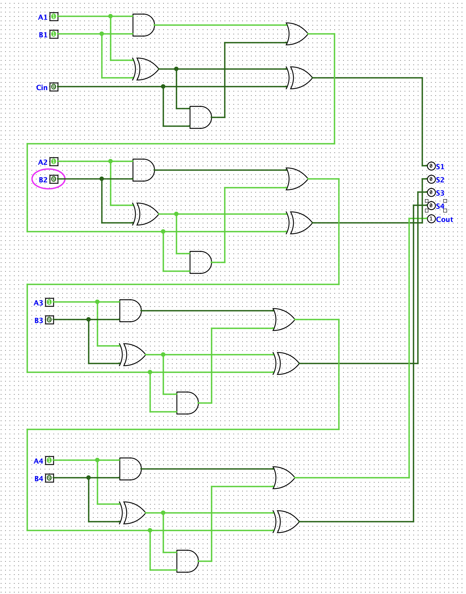

# 📚 L1.3 4 位行波进位加法器(Ripple Carry Adder) 学习笔记

> 日期:2026-07-01
> 目标:理解"为什么 1 个全加器不够 → 怎么把 4 个全加器串起来算 4 位二进制加法"

---

## 一、为什么需要"多位加法器"?—— 1 个全加器只能算 1 位

L1.2 我们搭了全加器,能算 `A + B + Cin`,产出 S 和 Cout —— **只能算 1 位**。

但**现实里的数都是多位的**(`5 + 3 = 8` 是 4 位二进制 `0101 + 0011 = 1000`)。

**问题:** 一个全加器只能算 1 bit,4 bit 的数怎么办?

---

## 二、关键洞察:进位 Cout 不是"副产品",而是"桥"

**核心思路(一句话):** 把 N 个全加器**一个接一个串起来**,前一个的 Cout 接下一个的 Cin。

### 2.1 用 `5 + 3 = 8` 当例子走一遍

二进制 `0101 + 0011`,从右往左一列一列算:

| 第几位 | 这一列的输入 | 计算过程 | 本位 S | 往左送 Cout |
|:------:|-------------|---------|:------:|:----------:|
| 第 1 位(最右) | A=1, B=1, **Cin=0**(无初始进位) | 1+1+0 | 0 | **1**(往上送) |
| 第 2 位 | A=0, B=1, **Cin=1**(收到上面的进位) | 0+1+1 | 0 | **1**(继续往上送) |
| 第 3 位 | A=1, B=0, **Cin=1**(再收到) | 1+0+1 | 0 | **1**(继续往上送) |
| 第 4 位(最左) | A=0, B=0, **Cin=1**(最高位收到) | 0+0+1 | **1** | 0 |

**结果:** S = `1000` = 8,Cout = 0 ✓

### 2.2 关键观察

看每一列的"输入":**Cin 那一格,就是"上一列算完送过来的 Cout"**。

这意味着:

- 第 1 列的 Cin 是外部给的(通常 0)
- 第 2~N 列的 Cin,**必须接上一列的 Cout**,不然就算错(比如第 2 列收不到第 1 列送来的 1,就会算成 `1+1=0`,少算一个)

**所以"RCA 是 N 个全加器 + 一条进位链"**,这条链就是它的灵魂。

---

## 三、行波进位加法器(Ripple Carry Adder, RCA)定义

把 N 个全加器**串起来**:

| 项 | 说明 |
|----|------|
| 输入 | `A[N-1..0]`、`B[N-1..0]`、`Cin`(初始进位,通常为 0) |
| 输出 | `S[N-1..0]`(本位和)、`Cout`(最高位的溢出进位) |
| 关键连线 | 每个全加器的 `Cout` → 下一个全加器的 `Cin` |
| 名字由来 | "进位像波浪一样,从最低位向最高位逐级传递" |

**我们的目标版本:N = 4**(4 位加法器,能算 0~15 的加法)

---

## 四、4-bit RCA 接口

| 输入 | 含义 | 数量 |
|------|------|:----:|
| `A1`~`A4` | 第 1 个数(A)的 4 位(低位→高位) | 4 |
| `B1`~`B4` | 第 2 个数(B)的 4 位(低位→高位) | 4 |
| `Cin` | 初始进位(通常接地=0) | 1 |

| 输出 | 含义 | 数量 |
|------|------|:----:|
| `S1`~`S4` | 本位和(4 位) | 4 |
| `Cout` | **最终溢出进位**(15+1 时变 1) | 1 |

**总共 9 个输入 + 5 个输出。**

---

## 五、关键连线表(4-bit RCA 的"骨架")

| 线 # | 起点 | 终点 | 作用 |
|:----:|------|------|------|
| 1 | Cin Pin | FA1.Cin | 给最右边那个全加器初始进位(通常 0) |
| 2 | FA1.Cout | FA2.Cin | 第 1 位的进位送给第 2 位 |
| 3 | FA2.Cout | FA3.Cin | 第 2 位的进位送给第 3 位 |
| 4 | FA3.Cout | FA4.Cin | 第 3 位的进位送给第 4 位(最高位) |
| 5 | FA4.Cout | Cout Pin | 最终溢出信号输出 |

**不接这 5 根线,4 个全加器就是各自独立的 1-bit 加法器 —— 不是多位加法器!**

---

## 六、Logisim 实现

### 6.1 元件清单

| 类型 | 数量 | 用途 |
|------|------|------|
| Input Pin | 9 | A1~A4, B1~B4, Cin |
| Output Pin | 5 | S1~S4, Cout |
| 全加器(FA) | 4 | FA1(最低位)~FA4(最高位) |

> **注:**L1.3 没继续一格一格拼门,直接复用了 L1.2 验证过的全加器结构(可以门级拼,也可以用 Logisim 自带的 Full Adder 组件)。

### 6.2 实际电路图



*图:从上到下 4 个全加器(Cin → A1/B1 → A2/B2 → A3/B3 → A4/B4),每层 5 个门(XOR × 2 + AND × 2 + OR × 1);右侧 S1~S4 + Cout 输出。*

---

## 七、验证 checklist —— 5 组代表性测试

**这是关键:** 5 组测试覆盖了"无进位、链式进位、溢出"三种情况。

### 测试 1:`0 + 0 = 0`(最平凡)

- A: 全 0,B: 全 0,Cin: 0
- 期望:S1~S4 全 0,Cout=0

### 测试 2:`1 + 1 = 2`(看低位的进位能不能送上去)

- A: A1=1(其它 0),B: B1=1(其它 0),Cin: 0
- 期望:S1=0, **S2=1**, S3=0, S4=0, Cout=0

### 测试 3:`5 + 3 = 8`(标志性算例)

- A: A1=1, A3=1(0101=5),B: B1=1, B2=1(0011=3),Cin: 0
- 期望:S1=0, S2=0, S3=0, **S4=1**, Cout=0

### 测试 4:`7 + 7 = 14`(边界情况)

- A: A1=A2=A3=1(0111=7),B: B1=B2=B3=1(0111=7),Cin: 0
- 期望:**S1=0, S2=1, S3=1, S4=1**, Cout=0(1110=14)

### 测试 5:`15 + 1 = 16`(溢出!)

- A: A1=A2=A3=A4=1(1111=15),B: B1=1(0001=1),Cin: 0
- 期望:S1~S4 全 0,**Cout=1**(4-bit 装不下 16,溢出归零,Cout 报警)

---

## 八、踩坑记录(给自己提个醒)

### 8.1 第 1 个全加器的 Cout 漏接 —— 最常见错误

我今天搭的时候就踩了这个坑:搭好 2 个 FA,发现 S 输出怎么都不对(尤其是 `5+3=8` 时 S4 不亮)。

**原因:** 第 1 个 FA 的 Cout 没接到第 2 个 FA 的 Cin,两个 FA 是各自独立的。

**教训:** **接 RCA 永远先接进位线**(Cin/Cout 串),再接数据线(A、B、S 输出),不然调试起来会怀疑人生。

### 8.2 Cin 不是第 5 位数据,只是"初始进位"

我之前脑子里闪过"5 位加法器"的想法 —— 错的。

```
Cin 是"上一步的进位"(1 个 bit),不是"第 5 个要加的数"
```

**N 个全加器 + 1 个 Cin Pin = N-bit 加法器**,不是 (N+1)-bit。

---

## 九、我学到的核心方法论

1. **"行波进位"思路**:把多位加法拆成"多个 1 位加法 + 进位链",这是 RCA 的核心思想,也是后面学 ALU 的基础。
2. **"溢出检测"思路**:4-bit 加法器算 `15+1=16` 时,S 全 0 但 Cout=1 —— Cout 本身就是个"溢出标志",以后做 ALU/比较器都会用上。
3. **"先接控制线,再接数据线"**:RCA 调试的时候,先把 5 根进位线接好,数据线后接,效率高很多。

---

## 十、下一步预告

**L2.1 内存(RAM)**:有了加法器,下一步搭 RAM —— 程序和数据都存在 RAM 里,这是冯诺依曼架构的"存储"基础。

搭好 RAM,才能真正开始让"程序"自动跑起来(而不只是手动拨 Pin 算 `5+3`)。

---

## 附录:本节核心数据

| 项 | 值 |
|----|---|
| 输入 bit 数 | 4 (A) + 4 (B) + 1 (Cin) = 9 |
| 输出 bit 数 | 4 (S) + 1 (Cout) = 5 |
| 用的全加器 | 4 个 |
| 关键连线 | 5 根(Cin + 4 个级联 Cout) |
| 能算的最大无溢出数 | 15 + 14 = 29(超过 16 就溢出)|